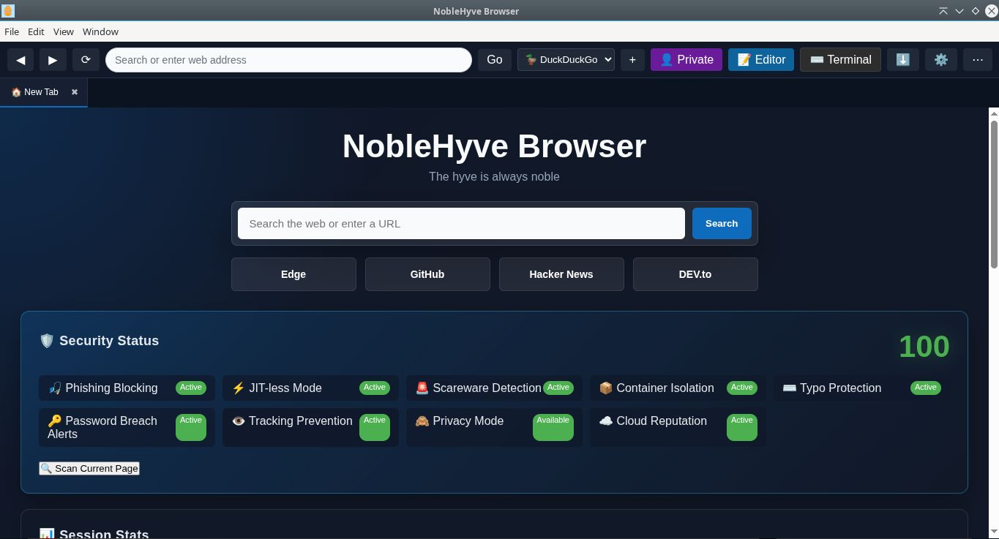

# Noblehyve Browser

**Secure browsing meets a fully encrypted code editor, cloud storage, and an integrated terminal — all in one cross-platform desktop app.**

Noblehyve is an Electron-based browser built from scratch that combines everyday web browsing with a developer's toolkit. Edit code, run it with a real PTY terminal, encrypt your work with passwords that never leave your device, and sync it to your own Cloudflare R2 cloud storage.


---

## Features

### 🔒 Privacy-first encryption
- Files are encrypted **on your device** with your own password — the password never leaves your machine.
- Save encrypted `.enc` files locally or to the cloud; open them with the password you chose.
- Cloud credentials are stored using Electron `safeStorage`.

### 🌐 Secure browser
- Tabbed Chromium web browsing with history management, downloads, and a custom context menu.

### 💻 Built-in code editor
- CodeMirror-powered editor with syntax highlighting.
- Run code inline, preview HTML, and stop runaway processes.

### 🖥️ Integrated terminal
- VS Code-style bottom panel with **Terminal** and **Output** tabs.
- Real PTY sessions via `node-pty` + `xterm.js`, resize-aware.
- Send code from the editor straight to the terminal.

### ☁️ Cloud storage (Cloudflare R2)
- Upload and restore files to your own R2 bucket — content is encrypted before it ever leaves your device.
- Searchable cloud file picker and storage usage tracking.

### 📊 Built-in analytics pipeline
- Local telemetry pipeline with SQLite storage and optional Kafka.
- HTTP server exposes `GET /events` (REST) and `GET /events/stream` (SSE) for Jupyter-style access.

### 👤 Accounts
- Create an account or sign in with Google (Supabase Auth).
- Premium license management for paid features.

### 🧰 More
- Password manager, download manager, browser history, terminal sessions, and a standalone terminal window.

---

## Screenshots



---

## Downloads

Latest release: [github.com/mckenziemdt25/noblehyve-browser/releases/latest](https://github.com/mckenziemdt25/noblehyve-browser/releases/latest)

| Platform | File | Install |
|---|---|---|
| **Windows** | [Noblehyve-Setup-1.0.0.exe](https://github.com/mckenziemdt25/noblehyve-browser/releases/latest/download/Noblehyve-Setup-1.0.0.exe) | Run the installer |
| **Linux (Universal)** | [Noblehyve-1.0.0.AppImage](https://github.com/mckenziemdt25/noblehyve-browser/releases/latest/download/Noblehyve-1.0.0.AppImage) | `chmod +x` and run |
| **Linux (Debian/Ubuntu)** | [noblehyve-browser_1.0.0_amd64.deb](https://github.com/mckenziemdt25/noblehyve-browser/releases/latest/download/noblehyve-browser_1.0.0_amd64.deb) | `sudo apt install ./noblehyve-browser_1.0.0_amd64.deb` |
| **Linux (Fedora/RHEL)** | [noblehyve-browser-1.0.0.x86_64.rpm](https://github.com/mckenziemdt25/noblehyve-browser/releases/latest/download/noblehyve-browser-1.0.0.x86_64.rpm) | `sudo dnf install ./noblehyve-browser-1.0.0.x86_64.rpm` |
| **Linux (Portable)** | [noblehyve-browser-1.0.0.tar.gz](https://github.com/mckenziemdt25/noblehyve-browser/releases/latest/download/noblehyve-browser-1.0.0.tar.gz) | Extract and run |

> **Windows note:** the installer is unsigned, so Windows SmartScreen may show a warning on first run.

---

## Building from source

Requires Node.js 20+.

```bash
npm install

# Run in development
npm start

# Build installers
npm run dist:win        # Windows (NSIS + APPX)
npm run dist:linux      # Linux (deb + snap)
npx electron-builder --linux AppImage deb rpm tar.gz   # all Linux formats
```

Releases are built and published automatically by GitHub Actions when a `v*` tag is pushed:

```bash
git tag v1.0.0 && git push origin v1.0.0
```

---

## Tech stack

| Layer | Technology |
|---|---|
| Desktop shell | Electron 42 |
| Editor | CodeMirror 5 |
| Terminal | xterm.js + node-pty |
| Local storage | better-sqlite3 |
| Encryption | crypto-js (AES) |
| Cloud storage | Cloudflare R2 (AWS SDK S3) |
| Auth & licenses | Supabase |
| Telemetry pipeline | KafkaJS + SQLite |

---

## Privacy

Noblehyve is designed so that your encryption passwords and file contents never leave your device. See [PRIVACY.md](PRIVACY.md) for the full privacy policy.

## License

[MIT](LICENSE)
